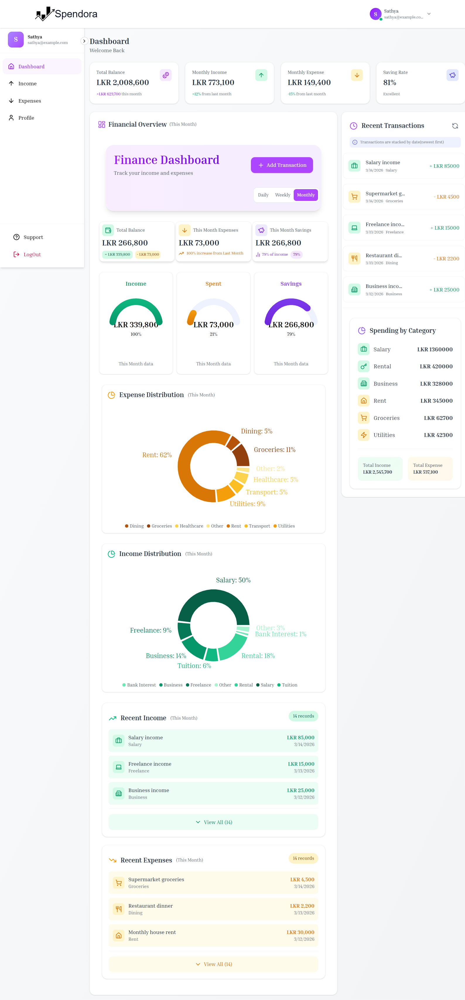
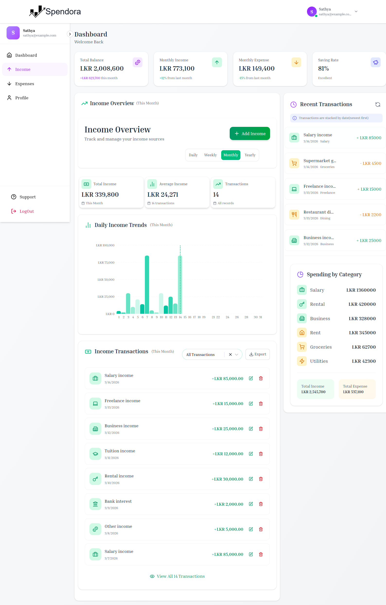
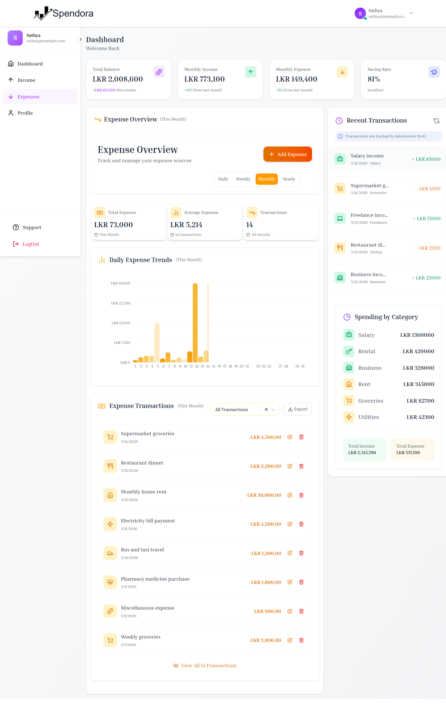
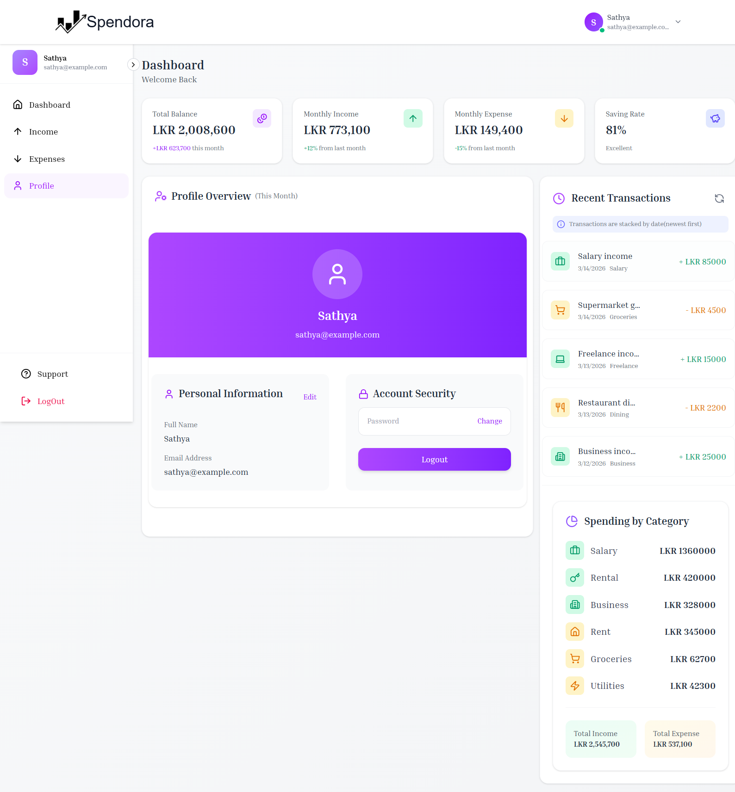

# 💰 Spendora

[](https://react.dev/)
[](https://nodejs.org/)
[](https://www.mongodb.com/)
[](https://expressjs.com/)
[](https://tailwindcss.com/)

---

# 💰 About Spendora

**Spendora** is a full-stack **Personal Finance & Expense Tracking Application** built using the **MERN Stack (MongoDB, Express.js, React.js, Node.js).**

It helps users manage their **personal finances by tracking income, expenses, and savings** through an intuitive and modern dashboard.

The application allows users to:

- Record income and expense transactions
- Categorize financial activities
- Monitor financial trends
- Analyze spending behavior
- Export financial data reports

Spendora provides a **clean financial dashboard with interactive charts, transaction management, and exportable reports**, making it suitable for individuals who want to **monitor and control their finances efficiently**.

This project simulates a **real-world personal finance management platform**, focusing on:

- Modern responsive UI
- Financial analytics dashboard
- Secure authentication
- Income and expense tracking
- Data export and reporting

A **portfolio-ready full-stack finance management application.**

---

# ✨ Features

## 👤 User Features

- Add income transactions
- Add expense transactions
- Edit and delete transactions
- Categorize income and expenses
- Filter transactions by category
- View financial dashboard overview
- Track monthly income and expenses
- Monitor savings and spending trends
- View interactive financial charts
- Export financial data to **Excel reports**
- Responsive modern UI
- Real-time financial statistics

---

# 🛠️ Technologies Used

## Frontend

- React (Vite)
- Tailwind CSS
- React Router DOM
- Axios
- React Toastify
- Recharts (Data Visualization)
- React Spinners (Loading Indicators)
- Lucide React Icons
- Framer Motion (Animations)
- XLSX (Excel Export)

---

## Backend

- Node.js
- Express.js
- MongoDB
- Mongoose
- REST APIs
- JWT Authentication
- XLSX (Excel Report Generation)

---

# 📸 Screenshots

## 📊 Dashboard



---

## 💰 Income Page



---

## 💳 Expense Page



---

## 👤 Profile Page



---

# ⚙️ How to Run the Project

## 1️⃣ Clone Repository

```bash
git clone https://github.com/PrethigahShanmugarajah/Spendora.git
cd Spendora
```

---

## 2️⃣ Backend Setup (Server)

```bash
cd Server
npm install
npm run server
```

---

## 3️⃣ Frontend Setup (Client)

```bash
cd Client
npm install
npm run dev
```

---

# 🔑 Environment Variables

## 📂 Server (.env)

```
PORT=
MONGODB_URL=
JWT_SECRET=
JWT_EXPIRES_IN=
```

---

## 📂 Client (.env)

```
VITE_BASEURL=
VITE_CURRENCY=
```

---

# 👨‍💻 Author

**Prethigah Shanmugarajah (2020/2021)** <br>
Department of Software Engineering <br>
Faculty of Computing <br>
Sabaragamuwa University of Sri Lanka

---
